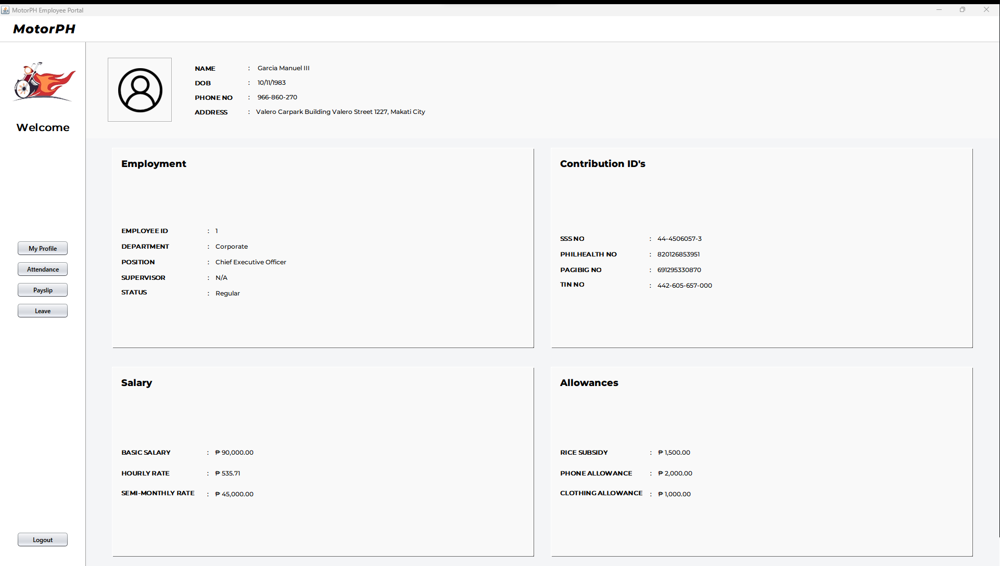
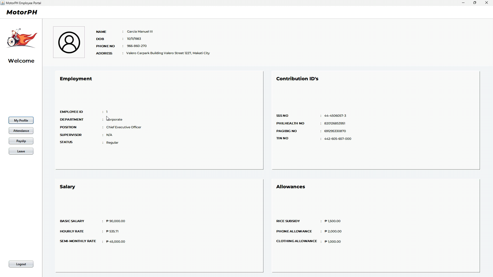
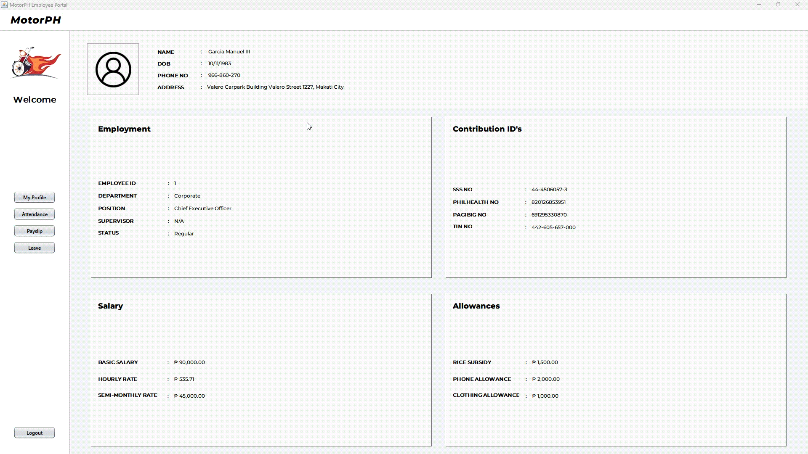
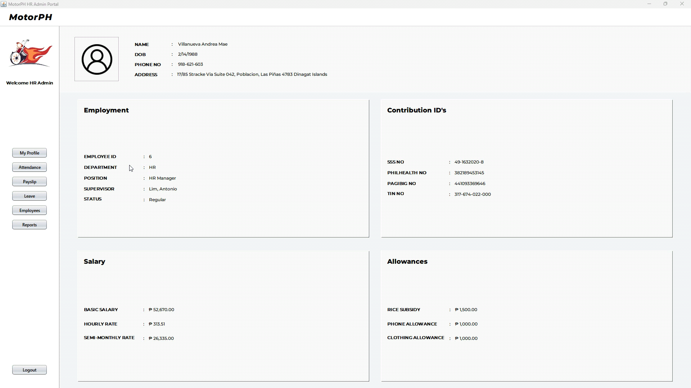
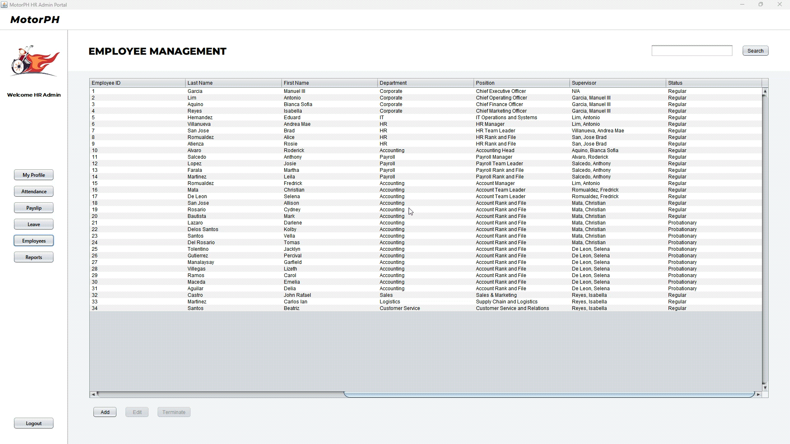
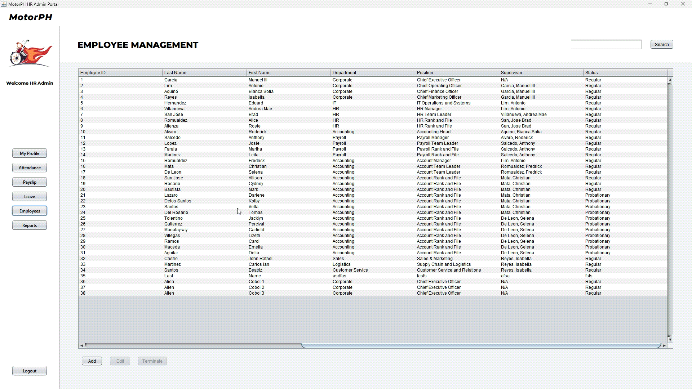
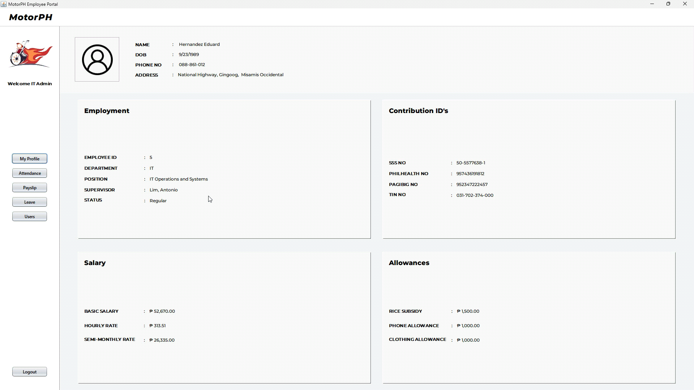
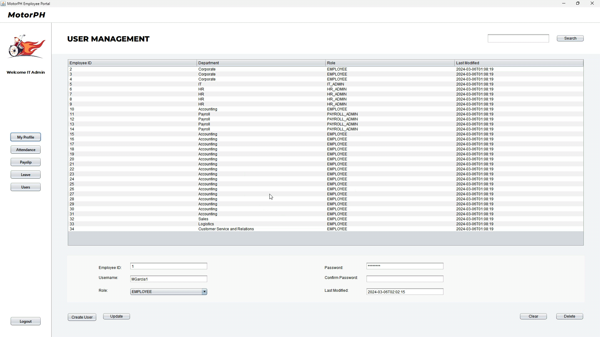
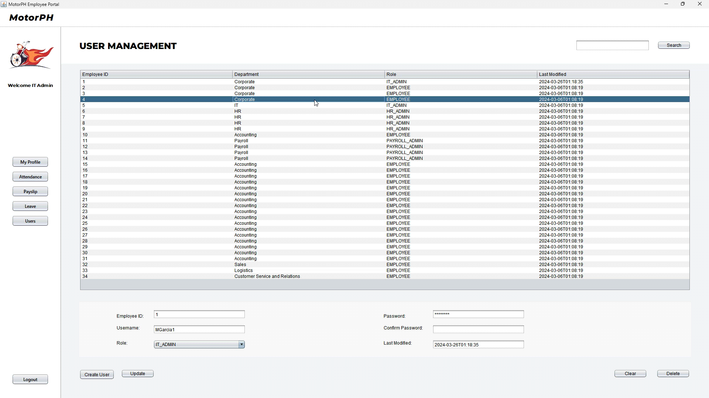

# MotorPH Payroll System

This project is a payroll management system made for MotorPH. 
It features user management, employee management, attendance and leave management, and payroll management.
This system version includes various roles and permissions which include: 
- IT Admin, 
- HR Admin, 
- Payroll Admin, and
- Employee.

Note: MotorPH is a fictional company made to learn for students in Mapua Malayan Digital College (MMDC).

## To Run Locally

The application can run on the following platforms:
- Windows
- macOS
- Linux

The following steps are required to run the application:
- Download and install Java 17 LTS or late from [Oracle](https://www.oracle.com/java/technologies/downloads).
- Download the zip file from the [Latest Release](https://github.com/DroidZeroCodes/Payroll_System/releases).
- Extract the files.
- Run the `mph-payrollsys.jar` file.

## Usage

To use the application, simply run the `mph-payrollsys.jar` file. 

**Login**

* You can log in by entering your username and password.
  * Check the files at database/UserCredentials to see the dummy credentials that can be used to log in. You can choose the user role you want to login as:
    * IT Admin, 
    * HR Admin, 
    * Payroll Admin, and 
    * Employee.
  * If you want to log in as a new user, the _only option currently available_ is to request the IT admin to create an account. 
    * Check the [IT Admin section](#user-management) on how to create another user.
* Once logged in, the system will determine your role based on your registered account. 

You may watch this video for a full demo:

## Regular Employee
Once you are logged in as a regular employee, you will be able to view your 
  * personal information, 
  * payslip,
  * attendance, and 
  * leave.

### Personal Information
**View Personal Information**

* To view your personal information, you can navigate to the `Profile` section by clicking the `My Profile button`, then you will be able to see your personal information.
  * Initially you would be directed to your profile page after logging in.
* Note: Currently, the system does not support editing personal information.

#### Attendance Management
**View Attendance**

* To view your attendance, you can navigate to the `Attendance` section by clicking the `Attendance button`, then you will be able to see an attendance table showing your historical attendance from newest to oldest.
  * The table supports filtering by searching using the calendar picker above the table.
  * You may also sort the table by clicking on the column headers.

**Clock In and Clock Out**
* To clock in and out, you can use the `Clock In` and `Clock Out` buttons below the attendance table.

### Payslip
**View Payslip**

* To view your payslip, you can navigate to the `Payslip` section by clicking the `Payslip button`, then you will be able to see a payslip table showing your newest payslip.
  * You may also view payslips based on the period such as 
    * Monthly,
    * Weekly,
    * or Semi-Monthly.
  * You may also search for specific payslips (only for the current year) for specific months by using the dropdown menu at the top of the table.
  * _Note_: Currently, the system does not support viewing the history of payslips.

**Save and Print Payslip**

* You may save your payslip in a `PDF` format by clicking the `Save PDF` button.
* Additionally, you may print your payslip by clicking the `Print` button.

### Leave Management
**View Leave**

* To view your leave, you can navigate to the `Leave` section by clicking the `Leave button`, then you will be able to see a leave table showing your leave history with their status.

**View Leave Balance**
* Meanwhile, you would be able to see your current balance of leaves below the table.
  * The system currently has these leave types:
    * Sick,
    * Vacation,
    * Paternal, and
    * Bereavement.

**Submit Leave Request**

* To submit a leave request, you can follow the following steps:
  * First you must identify the leave type, and ensure that you have sufficient leave balance. 
    * You can change the leave type on the drop-down menu.
  * Next, you must choose the start and end date of your leave by using the calendar.
    * The system would automatically calculate the number of days of your leave.
  * Optionally, you may also add a reason for your leave request.
  * After finalizing your leave request, you should use the `Submit Leave Request` button.

## Payroll Admin
When you login as a payroll administrator, you will be able to see additional buttons on the sidebar to access other features such as:
- Run Payroll (Payroll Processing), and
- Reports (Payroll Report)

However, when it comes to information and attendance management, payroll admin has the same permissions as regular employees.

### Payslip
**View Payslip (Extra)**

* Similar to the regular employee, you can view your payslip by navigating to the `Payslip` section.
* As with the regular employee, you may also search for specific payslips (only for the current year) for specific months by using the dropdown menu at the top of the table.
* The only difference is that you will be able to view other employee's payslips by using the search bar.

### Payroll Processing
**Batch Processing**

* For payroll processing, you can navigate to the `Payroll Run` section by clicking the `Run Payroll button`.
* Initially you would be directed to batch processing, you can switch to manual processing by clicking the `Manual` button on the top-right corner beside the `Search` button.
* For batch processing you may:
  * Choose the period you want to process such as monthly, weekly, or semi-monthly.
  * Click the `Process` button to start processing.
  * Use the `Search` button to search for employees using their employee ID on the results.
  * Click the `Submit` button to submit the batch.

**Manual Processing**

* As for manual processing, you may:
  * Enter the required information in the fields.
  * You may also use the `Search` button to search for employees using their employee ID.
    * This would automatically fill the fields with the employee's information. You may then edit the results depending on the scenario.
  * After all fields are required specifically on the `Employment`, `Attendance`, and `Allowance` sections, you may click the `Calculate` button.
  * After the calculation is completed, you may click the `Save` button to submit the manual process.
  * You may also click the `Reset` button to clear all fields.

### Payroll Report
**Generate Payroll Report**

* To generate a payroll report, you can navigate to the `Report` section by clicking the `Reports button`.
* You may choose the period and generate the report by clicking the `Generate` button.
  * You can also search for specific employees by using the search bar.

## HR Admin
When you log in as an HR administrator, you will be able to see additional buttons on the sidebar to access other features such as:
- Employees (Employee Management), and
- Reports (Attendance Report)

However, when it comes to payslips, HR admin has the same permissions as regular employees.

### Attendance Management
**View Attendance (Extra)**

* Like the regular employee, you can view your attendance by navigating to the `Attendance` section.
* Additionally, you would also be able to view other employee's attendance.
  * You can search for specific employees by using the search bar.

### Leave Management
**View Leave (Extra)**

* Like the regular employee, you can view your leave by navigating to the `Leave` section.
* Additionally, you would also be able to view other employee's leave.
  * You can search for specific employees by using the search bar.

**Approve or Decline Leave**

* To approve or decline a leave, you can `double-click` any cell that contains the leave request.
  * This would open the leave request approval window showing the leave request and its status.
  * In here you can then approve or decline the leave request.
  * _Note_: Our system does not support undoing a leave request approval. Thus, once you decline or approve a leave request, you cannot undo it.

### Employee Management
**View Employee**

* To manage employees, you can navigate to the `Employees` section by clicking the `Employees button`.
* You can search for specific employees by using the search bar.

**Add Employee**

* To add new employees, you can click the `Add Employee` button.
  * This would open a form where you can add new employee information.
  * After adding the employee, you can click the `Save` button to submit the form, or the `Cancel` button to cancel.
  * The form also accepts adding multiple employees through a CSV file by clicking the `Add from CSV` button. However, make sure that the CSV file is in the correct format.
    * 
  * Note: Currently the system does not support uploading a photo of the employee.

**Update Employee**

* To update an existing employee, first you must click the cell that contains the employee you want to update. Then you can click the `Edit` button.
  * This would open a form where you can update the employee information.
  * After updating the employee, you can click the `Update` button to submit the form, or the `Cancel` button to cancel.

**Terminate Employee**

* To delete an employee, first you must click the cell that contains the employee you want to delete. Then you can click the `Terminate` button.
* _Note:_ If you see the upload and terminate buttons _un-clickable_, it means that you have not clicked a cell yet.

### Attendance Reports
**Generate Attendance Report**

* To generate attendance reports, you can navigate to the `Reports` section by clicking the `Reports button`.
* You can choose the period and generate the report by clicking the `Generate` button.
  * You can also search for specific employees by using the search bar.

## IT Admin
When you log in as an IT administrator, you will be able to see additional buttons on the sidebar to access other features such as:
- Users (User Management)

However, overall, we have limited the IT admin's permissions as regular employees since already have specific roles for other functions.
- _Note:_ This is only temporary as it will be up for further discussions by the users and developers.

### User Management
**View Users**

* To manage users, you can navigate to the `Users` section by clicking the `Users button`.
  * This will show a user table with all users in the system, with the timestamp of when the record was modified.
* You can search for specific users by using the search bar.

**Add User**

* To add new users, 
  * First you must fill out the fields below the table.
  * Then, you can click the `Create` button to submit the form;
  * _Note_: To create another user, the user must first be registered as an employee on the system, thus the HR Admin must first [register/add](#employee-management) the employee in the database.

**Update User**

* To update an existing user, 
  * First you must click the cell that contains the user you want to update. 
  * Or manually fill up the fields with existing information. 
  * Then you can click the `Update` button to save the changes.
  * When updating the password make sure that the password is the same as the confirmation password.

**Delete User**

* To delete a user, first you must click the cell that contains the user you want to delete. 
* Or you can simply input the employee ID in the field.
* Then you can click the `Delete` button.

## Documentation

Refer to the [documentation](https://droidzerocodes.github.io/Payroll_System/docs/index.html) for more technical information.
* You may view our use case diagram at: [Use Case Diagram](https://lucid.app/lucidchart/5ffc7b2f-824a-47af-989b-3316d543fb02/edit?invitationId=inv_e0b69186-8281-44a3-95bb-c5fbacc4dc29)
* You may view our class diagram at: [Class Diagram](https://lucid.app/lucidchart/ab94eaea-39ec-4fdf-8cdf-c1b727dcdd66/edit?viewport_loc=-192%2C-2316%2C6209%2C3150%2C0_0&invitationId=inv_7754eb69-ca67-4a8d-b825-cee65fb99e4c)
* You may view our test cases at: [Test Cases](https://docs.google.com/spreadsheets/d/19x0HROuuZ02CEAZDovUyHUGdcbfAVtY1Gw_6LZM-b8k/edit?usp=sharing)

## Author
This project was developed by Group 10 of MMDC BSIT II. AY 2023-2024 which consists of:
- [Harvey Dela Flor](https://github.com/DroidZeroCodes) 
- [Ibrahim Desouky Harby](https://github.com/IbraDoesCode)
- [Irish Venice San Jose](https://github.com/irishvenicesj3)
- [Enrialyn Hermosura](https://github.com/EnrialynH)

And supervised by:
- [Armando Sta Cruz III](https://github.com/SirArmie-MMDC)
